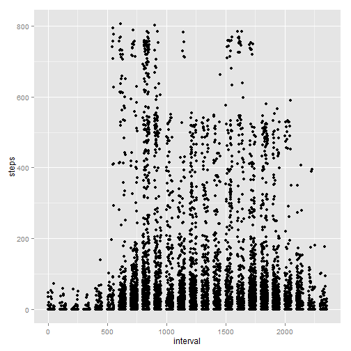
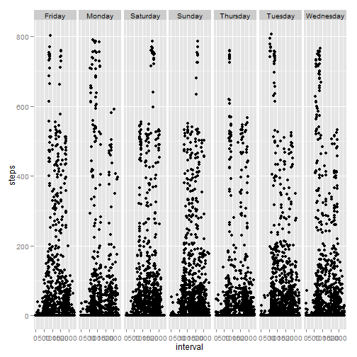
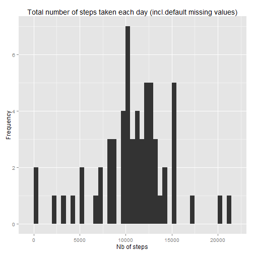
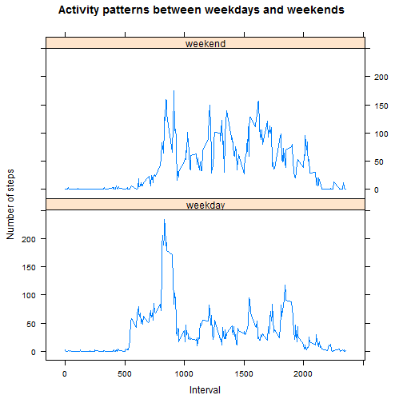

Reproducible Research: Peer Assessment 1
========================================
Coursera - Stephane Vercellotti

Report generation date: "2015-04-19"

output: 
  html_document:
    keep_md: true
    
    
### loading libraries

```r
library(knitr)
library(ggplot2)
library(plyr)
library(dplyr)
```

### Setting global options

```r
opts_chunk$set(echo=TRUE,results="hold")
options(scipen = 1)  # Turn off scientific notations for numbers
Sys.setlocale("LC_TIME", "English") 
```

```
## [1] "English_United States.1252"
```


## 1. Loading and preprocessing the data


```r
df <- read.csv("activity.csv")
```
This dataframe has the following structure:

```r
str(df)
```

```
## 'data.frame':	17568 obs. of  3 variables:
##  $ steps   : int  NA NA NA NA NA NA NA NA NA NA ...
##  $ date    : Factor w/ 61 levels "2012-10-01","2012-10-02",..: 1 1 1 1 1 1 1 1 1 1 ...
##  $ interval: int  0 5 10 15 20 25 30 35 40 45 ...
```


## 2. What is mean total number of steps taken per day?

We need to group the records by day, and compute the sum of steps across each interval

```r
agg_df <- aggregate(steps ~ date,df,sum)
```

Histogram of the total number of steps taken each day


```r
g <- ggplot(agg_df, aes(x=steps)) + geom_histogram(binwidth=500)
g <- g + geom_vline(xintercept=median(agg_df$steps), size=2, color="green",labels="Median")
g <- g + geom_vline(xintercept=mean(agg_df$steps), linetype="dashed", size=1, color="red",labels="Mean")
g <- g + labs(title = "Total number of steps taken each day", x = "Nb of steps", y = "Frequency")
print(g)
```

 

Mean of the total of steps taken each day:

```r
mean(agg_df$steps)
```

```
## [1] 10766.19
```

Median of the total of steps taken each day:

```r
median(agg_df$steps)
```

```
## [1] 10765
```


The mean **10766.19** and the median **10765** are close to each other (*These values are highlighted on the above histogram as coloured lines*).


## 3. What is the average daily activity pattern?

Let's now group the dataframe across all intervals and get the mean steps values (*dataframe column name is "mean_steps"*):

```r
int_df  <- df %>% 
              group_by(interval) %>% 
                 summarise(mean_steps = mean(steps,na.rm=TRUE))
```

graphical representation:

```r
plot(int_df$interval 
    ,int_df$mean_steps
    ,type="l"
    ,xlab = "5-Minute Interval"
    ,ylab = "Average Nb of steps"
    ,main = "Average daily activity pattern")
 # draw a vertical line to highlight the interval having the highest mean nb of steps
 int_max <- int_df[int_df$mean_steps==max(int_df$mean_steps),]
 int_max_interval <- int_max$interval
 int_max_steps    <- int_max$mean_steps
 abline(v=int_max_interval, col="red")
 axis(1, at=int_max_interval,labels=int_max_interval)
```

 


=> The 5-minute interval, on average across all the days in the dataset, that contains the maximum number of steps is **835** with a total of **206** steps.


## 4. Imputing missing values

The presence of missing days may introduce bias into some calculations or summaries of the data.

Total number of missing values in the dataset (i.e. the total number of rows with NAs)


```r
sum(is.na(df$steps))
```

```
## [1] 2304
```

There're **2304** missing values out of **17568** records. This represents roughly 
**13%** which is quite significant.


###Devising a strategy for filling in all of the missing values in the dataset. 


```r
qplot(interval,steps, data = df, na.rm=TRUE)
```

 


```r
# Add weekday to the core data frame
df$weekday <- weekdays(as.Date(df$date))
qplot(interval,steps, data = df, facets = . ~ weekday,na.rm=TRUE)
```

 

One option to fill in missing observations could be to compute the mean number of steps per interval on a weekday basis as the above patterns seems to differ from one day to another. This hypothesis seems to make sense rather than computing the mean across all days. 

###Create a new dataset that is equal to the original dataset but with the missing data filled in.

This section gets the mean nb of steps per interval per day, and merge the dataframes in order
to replace NAs with the mean values as default values 

```r
df_day <- aggregate(steps ~ interval + weekday, data=df, mean, na.rm = TRUE)
df_day$steps <- round(df_day$step,0)
colnames(df_day)[colnames(df_day)=="steps"] <- "default_steps"
df_filled <- merge(df,df_day,by=c("interval","weekday"))
df_filled$steps <- ifelse(is.na(df_filled$steps),df_filled$default_steps, df_filled$steps)
```

Grouping by date:

```r
agg_df_filled <- aggregate(steps ~ date,df_filled,sum)
```


```r
g <- ggplot(agg_df_filled, aes(x=steps)) + geom_histogram(binwidth=500)
g <- g + labs(title = "Total number of steps taken each day (incl.default missing values)", x = "Nb of steps", y ="Frequency")
print(g)
```

 

Mean of the total of steps taken each day:

```r
mean(agg_df_filled$steps)
```

```
## [1] 10821.1
```

Median of the total of steps taken each day:

```r
median(agg_df_filled$steps)
```

```
## [1] 11015
```

These values differs from the estimate in question 1.  


## 5. Are there differences in activity patterns between weekdays and weekends?

1. Adding a new factor variable to the dataset
   - "weekday" 
   - "weekend"
   

```r
df$weekday <- as.factor(sapply(df$date,function(x) ifelse(!(weekdays(as.Date(x)) %in% c('Saturday','Sunday')),"weekday","weekend")))
```

2. Activity patterns between weekdays and weekends

   First we compute the mean nb. of steps per interval and weekday type:

```r
df_day <- aggregate(steps ~ interval + weekday, data=df, mean)
```

   Then we draw a panel plot to represent data:

```r
library(lattice)
xyplot(
  steps ~ interval | weekday,
  df_day,
  type = "l",
  layout = c(1,2),
  main = "Activity patterns between weekdays and weekends",
  xlab = "Interval",
  ylab = "Number of steps"
)
```

 
   
   
