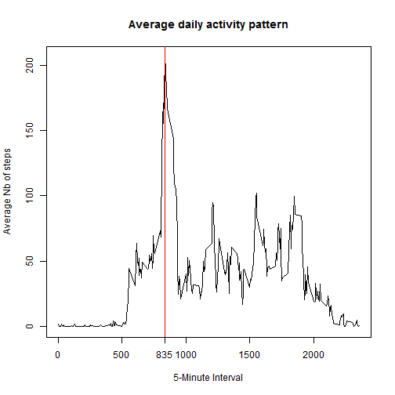

Reproducible Research: Peer Assessment 1
========================================
Coursera - S.Vercellotti - April 2015
date: "2015-04-17"

output: 
  html_document:
    keep_md: true
    
    
### loading libraries

```r
library(knitr)
library(ggplot2)
library(plyr)
library(dplyr)
```

```
## Warning: package 'dplyr' was built under R version 3.1.2
```

```
## 
## Attaching package: 'dplyr'
## 
## The following objects are masked from 'package:plyr':
## 
##     arrange, count, desc, failwith, id, mutate, rename, summarise,
##     summarize
## 
## The following object is masked from 'package:stats':
## 
##     filter
## 
## The following objects are masked from 'package:base':
## 
##     intersect, setdiff, setequal, union
```

### Setting global options

```r
opts_chunk$set(echo=TRUE,results="hold")
options(scipen = 1)  # Turn off scientific notations for numbers
Sys.setlocale("LC_TIME", "English") 
```

```
## [1] "English_United States.1252"
```


## 1. Loading and preprocessing the data


```r
df <- read.csv("activity.csv")
```
This dataframe has the following structure:

```r
str(df)
```

```
## 'data.frame':	17568 obs. of  3 variables:
##  $ steps   : int  NA NA NA NA NA NA NA NA NA NA ...
##  $ date    : Factor w/ 61 levels "2012-10-01","2012-10-02",..: 1 1 1 1 1 1 1 1 1 1 ...
##  $ interval: int  0 5 10 15 20 25 30 35 40 45 ...
```


## 2. What is mean total number of steps taken per day?

We need to group the records by day, and compute the sum of steps across each interval

```r
agg_df <- aggregate(steps ~ date,df,sum)
```

Histogram of the total number of steps taken each day


```r
g <- ggplot(agg_df, aes(x=steps)) + geom_histogram(binwidth=500)
g <- g + geom_vline(xintercept=median(agg_df$steps), size=2, color="green",labels="Median")
g <- g + geom_vline(xintercept=mean(agg_df$steps), linetype="dashed", size=1, color="red",labels="Mean")
g <- g + labs(title = "Total number of steps taken each day", x = "Nb of steps", y = "Frequency")
print(g)
```

 

Mean of the total of steps taken each day:

```r
mean(agg_df$steps)
```

```
## [1] 10766.19
```

Median of the total of steps taken each day:

```r
median(agg_df$steps)
```

```
## [1] 10765
```


The mean 10766.19 and the median 10765 are close to each other (*These values are highlighted on the above histogram*).


## 3. What is the average daily activity pattern?

Let's now group the dataframe across all intervals and get the mean steps values (*dataframe column name is "mean_steps"):

```r
int_df  <- df %>% 
              group_by(interval) %>% 
                 summarise(mean_steps = mean(steps,na.rm=TRUE))
```

graphical representation:

```r
plot(int_df$interval 
    ,int_df$mean_steps
    ,type="l"
    ,xlab = "5-Minute Interval"
    ,ylab = "Average Nb of steps"
    ,main = "Average daily activity pattern")
 # draw a vertical line to highlight the interval having the highest mean nb of steps
 int_max <- int_df[int_df$mean_steps==max(int_df$mean_steps),]
 int_max_interval <- int_max$interval
 abline(v=int_max_interval, col="red")
 axis(1, at=int_max_interval,labels=int_max_interval)
```

 


=> The 5-minute interval, on average across all the days in the dataset, that contains the maximum number of steps is r int_max$interval with a total of r round(int_max$mean_steps).


## 4. Imputing missing values


Note that there are a number of days/intervals where there are missing values (coded as NA). The presence of missing days may introduce bias into some calculations or summaries of the data.

Total number of missing values in the dataset (i.e. the total number of rows with NAs)


```r
sum(is.na(df$steps))
```

```
## [1] 2304
```

There're 2304 missing values out of 17568 records. This represents roughly 
13% which is quite significant.


Devise a strategy for filling in all of the missing values in the dataset. The strategy does not need to be sophisticated. For example, you could use the mean/median for that day, or the mean for that 5-minute interval, etc.

Create a new dataset that is equal to the original dataset but with the missing data filled in.


Make a histogram of the total number of steps taken each day and Calculate and report the mean and median total number of steps taken per day. Do these values differ from the estimates from the first part of the assignment? What is the impact of imputing missing data on the estimates of the total daily number of steps?


## 5. Are there differences in activity patterns between weekdays and weekends?
